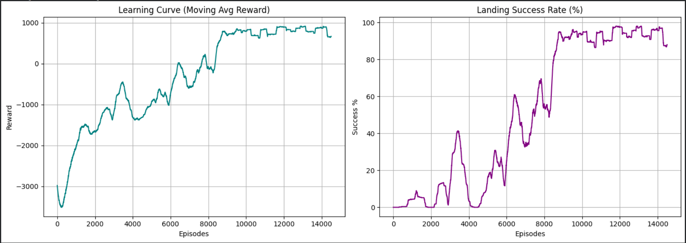

# KernelMind - SoC'26 Assignment 2
## The Adrian Descent: Physics-Based Reinforcement Learning

### Repository
```
https://github.com/dhuvsingla16/KernelMind---SOC-26
```

---

# Overview

This assignment focuses on building a complete reinforcement learning system from scratch for autonomous spacecraft landing. Inspired by *Project Hail Mary*, the objective is to train a Tabular Q-Learning agent capable of safely landing a probe on Adrian, a hostile exoplanet with high gravity and unpredictable atmospheric storms.

Unlike traditional reinforcement learning tasks that rely on pre-built environments, this assignment requires implementing every component manually—from the underlying physics simulation and Markov Decision Process to the Q-learning algorithm, reward shaping, training pipeline, and policy evaluation.

The final agent learns to control a binary spin-drive engine that performs a soft landing while minimizing fuel consumption and surviving dynamic wind disturbances.

---

# Problem Statement

A probe is dropped from an altitude of **1000 m** on Adrian.

The environment contains:

- Strong gravitational acceleration
- Dense atmosphere producing drag
- Randomly changing wind conditions
- Limited engine thrust
- Binary control actions

The objective is to learn a landing policy that

- reaches the surface,
- lands with a safe velocity,
- avoids flying away,
- minimizes fuel usage,
- and successfully adapts to stochastic weather.

---

# Environment

The environment is implemented using Newtonian mechanics with Euler Integration.

The probe maintains three state variables:

| State Variable | Description |
|---------------|-------------|
| Altitude (h) | Height above the surface |
| Velocity (v) | Vertical velocity |
| Wind State | Current atmospheric condition |

---

## Physics Model

At every simulation step,

```
F_net = F_gravity + F_thrust + F_drag
```

where

### Gravity

```
F_gravity = -m * g * (1 - h / R_adrian)
```

Gravity varies slightly with altitude.

---

### Engine Thrust

Binary action space

```
0 → Engine OFF

1 → Engine ON
```

When ON,

```
F_thrust = 25000 N
```

---

### Atmospheric Drag

```
F_drag = wind_multiplier × k_drag × v² × sign(-v)
```

Drag always opposes motion and becomes stronger during storms.

---

### Numerical Integration

Euler Integration updates the probe state every 0.1 s.

```
a = F_net / m

v = v + a·dt

h = h + v·dt
```

---

# Stochastic Wind Model

To satisfy the Markov Decision Process formulation, wind is modeled using three discrete states.

| Wind | Drag Multiplier |
|------|-----------------|
| Calm | 1.0× |
| Gusty | 1.5× |
| Adrian Gale | 2.5× |

Instead of changing randomly every timestep, wind evolves according to a transition probability matrix.

```
Calm  → [0.8  0.2  0.0]

Gusty → [0.1  0.7  0.2]

Gale  → [0.0  0.3  0.7]
```

This introduces temporal consistency into the weather while preserving stochasticity.

---

# State Space

Since altitude and velocity are continuous variables, they must be discretized before applying Tabular Q-Learning.

## Discretization

Altitude:

```
50 bins
```

Velocity:

```
40 bins
```

Wind:

```
3 states
```

The resulting Q-table dimensions become

```
51 × 41 × 3 × 2
```

where the final dimension corresponds to the two possible actions.

---

# Action Space

The agent chooses between two actions at every timestep.

| Action | Meaning |
|---------|---------|
| 0 | Spin-Drive OFF |
| 1 | Spin-Drive ON |

---

# Reward Function

Designing the reward function is the most important aspect of the assignment.

The reward is shaped to encourage

- safe landings,
- efficient fuel usage,
- faster descent,
- and avoidance of degenerate behaviors.

## Fuel Cost

Whenever the engine is active,

```
Reward -= 1
```

---

## Time Penalty

Every timestep,

```
Reward -= 1.1
```

This discourages unnecessary hovering.

---

## Successful Landing

If

```
Altitude ≤ 0

Velocity ≥ -3 m/s
```

the agent receives

```
+1500
```

---

## Crash

Unsafe impact receives a penalty proportional to landing speed.

```
Reward -= 100 × |velocity|
```

---

## Runaway Probe

If the probe rises above the maximum altitude,

```
Reward -= 500
```

Episode terminates.

---

## Hover Timeout

If maximum simulation steps are exceeded,

```
Reward -= 500
```

Episode terminates.

---

# Reinforcement Learning Algorithm

The agent is trained using Tabular Q-Learning.

The Bellman Update is

```
Q(s,a) ← Q(s,a)
        + α [ r + γ max Q(s',a') − Q(s,a) ]
```

---

# Hyperparameters

| Parameter | Value |
|-----------|-------|
| Learning Rate (α) | 0.13 |
| Discount Factor (γ) | 0.99 |
| Initial ε | 1.0 |
| Minimum ε | 0.01 |
| ε Decay | 0.999 |
| Episodes | 15000 |

---

# Exploration Strategy

An ε-greedy policy is used.

Initially,

```
ε = 1
```

allowing full exploration.

After every episode,

```
ε ← ε × 0.999
```

until

```
ε = 0.01
```

where the agent mainly exploits learned knowledge while retaining minimal exploration.

---

# Training Procedure

Each episode follows the sequence

```
Reset Environment

↓

Observe State

↓

Choose Action

↓

Apply Physics

↓

Receive Reward

↓

Update Q-table

↓

Repeat Until Episode Ends
```

For every episode the following metrics are stored

- Episode Reward
- Landing Success

These are later visualized using moving averages.

---

# Evaluation

After training completes,

- exploration is disabled,
- the learned greedy policy is executed,
- and the provided ASCII renderer visualizes the complete descent.

This demonstrates the learned landing behavior in real time.

---

# Results

After training the Tabular Q-Learning agent for **15,000 episodes**, the learned policy demonstrates a significant improvement in both cumulative reward and landing success despite operating in a stochastic environment with changing wind conditions.

## Training Performance

<p align="center">
  
</p>

The figure above illustrates two important learning metrics:

### Learning Curve (Moving Average Reward)

- The moving average reward steadily improves throughout training.
- Initially, the agent experiences highly negative rewards due to crashes, inefficient fuel usage, and random exploration.
- As training progresses, the Q-table converges toward better state-action values, allowing the probe to execute safer and more efficient descents.
- Minor fluctuations remain because of the stochastic wind model and continued ε-greedy exploration.

---

### Landing Success Rate

- The landing success percentage increases consistently over training.
- Initially, almost every episode results in failure.
- As the agent explores and updates its Q-values using the Bellman equation, successful soft landings become increasingly frequent.
- Small oscillations are expected due to probabilistic atmospheric disturbances and continued exploration during training.

---

Overall, the plots demonstrate that the learned policy successfully adapts to Adrian's uncertain environment and converges toward a stable landing strategy capable of safely completing the mission.

# Design Decisions

## Why Tabular Q-Learning?

The environment has a relatively small discretized state space, making Tabular Q-Learning an ideal choice.

It also provides complete visibility into how values evolve during learning.

---

## Why Reward Shaping?

Sparse rewards make learning extremely slow.

Intermediate penalties encourage efficient descent while the large terminal reward reinforces successful landings.

---

## Why Wind as a Markov Process?

Independent random wind would produce unrealistic weather.

Using a transition matrix preserves temporal correlations between consecutive wind states, creating a more realistic stochastic environment.

---

## Why Euler Integration?

Euler Integration is computationally simple while accurately approximating probe motion for sufficiently small timesteps. 

---

# Concepts Covered

- Newtonian Mechanics
- Euler Integration
- Markov Decision Process
- State Discretization
- Tabular Q-Learning
- Bellman Equation
- Reward Shaping
- Exploration vs Exploitation
- ε-Greedy Policy
- Stochastic Environment Modeling
- Reinforcement Learning Evaluation

---

# Conclusion

This assignment demonstrates the complete implementation of a reinforcement learning pipeline without relying on external RL libraries.

Beginning with a deterministic physics simulator and extending it into a stochastic Markov Decision Process, a Tabular Q-Learning agent successfully learns a robust landing strategy capable of adapting to changing atmospheric conditions. The project highlights the interaction between physical simulation, reward engineering, state representation, and reinforcement learning, providing a strong foundation for more advanced control problems and the RL-based operating system scheduler developed in subsequent KernelMind assignments.
